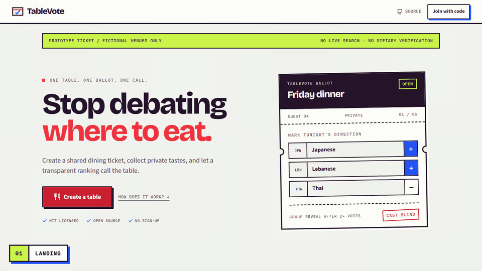
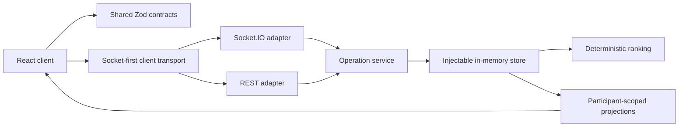

# TableVote

[](https://github.com/HaithamAlMaamari/tablevote/actions/workflows/ci.yml)
[](LICENSE)

TableVote is an accountless group-dining prototype that turns private ballots into one **deterministic consensus ranking**. It explores reproducible ranking, capability-scoped access, realtime coordination, and explicit no-match outcomes; it does not claim objective fairness.

> **Prototype boundary:** all restaurants and venue facts are generated fixtures. Sessions exist only in one Node.js process, disappear on restart, and are not suitable for real dietary or safety decisions. No public deployment is maintained.

[Quickstart](#quickstart) · [Walkthrough media](#walkthrough-media) · [Engineering tour](#engineering-tour) · [Documentation](docs/README.md) · [Limitations](#limitations)

## Quickstart

Requires Node.js `22.22+` within Node 22, or Node.js `24`, plus npm and a modern browser.

```bash
npm ci
npm run dev
```

Open `http://localhost:3000`. The Vite client proxies REST and Socket.IO traffic to the server at `http://localhost:3001`.

For a two-person evaluation, create a table in one browser profile and join its invite from an Incognito window or another profile. Ordinary tabs share participant identity through origin-local storage.

## Walkthrough Media



The walkthrough is captured from separate host and guest browser contexts against the built local app. Static references remain available for the [landing screen](docs/assets/landing.png), [private ballot](docs/assets/ballot.png), and [final result](docs/assets/result.png).

To regenerate it, install FFmpeg (tested with FFmpeg 8) and make `ffmpeg` available on `PATH`, then run a fresh production build followed by the package-independent capture entry point:

```bash
npm run build
node scripts/capture-screenshots.mjs
```

The script drives Playwright deterministically and removes its temporary frames after writing the checked-in assets. [`social-preview.png`](docs/assets/social-preview.png) is also available as a 1280x640 repository preview asset; this repository does not claim that GitHub is configured to use it.

## Verification

```bash
npm run verify
npm run verify:full
```

`verify` runs formatting, lint, documentation and repository guards, catalog reproducibility, tooling and application tests, production dependency policy, and builds. Coverage gates are aggregate across the included core server/domain files; the production smoke launches the built server as a separate process and is intentionally black-box rather than instrumented coverage. `verify:full` adds the built cross-browser suite and production smoke test. The production and full-inventory audits block unapproved high/critical advisories; both inventories are currently clean. Install browser binaries once with `npx playwright install chromium firefox webkit`.

Useful focused commands:

| Command                 | Purpose                                               |
| ----------------------- | ----------------------------------------------------- |
| `npm test`              | Unit and integration tests                            |
| `npm run test:coverage` | Enforce aggregate core server/domain coverage gates   |
| `npm run test:browser`  | Build and run browser flows                           |
| `npm run check:docs`    | Validate local Markdown links                         |
| `npm run check:catalog` | Check deterministic fixture generation                |
| `npm run audit:prod`    | Enforce the production dependency policy              |
| `npm run audit:all`     | Audit runtime, build, and test dependency inventories |
| `npm run smoke:prod`    | Build and smoke-test the single-port server           |

## Engineering Tour

Start with these boundaries:

1. [`shared/contracts.ts`](shared/contracts.ts) defines runtime Zod request and response contracts used by the server and client.
2. [`shared/failures.ts`](shared/failures.ts) defines typed domain failures independently of HTTP and Socket.IO.
3. [`server/operations.ts`](server/operations.ts) executes transport-neutral session operations and emits realtime effects.
4. [`server/rest.ts`](server/rest.ts) and [`server/sockets.ts`](server/sockets.ts) are thin validation and transport adapters.
5. [`server/store.ts`](server/store.ts) owns process-local state and accepts injectable state, clock, scheduler, catalog, and token factory dependencies.
6. [`shared/projections.ts`](shared/projections.ts) constructs participant-scoped views; [`shared/scoring.ts`](shared/scoring.ts) computes the deterministic ranking.
7. [`src/lib/transport.ts`](src/lib/transport.ts) validates server responses and retries timed-out socket mutations over REST with the same request ID.

The [operation and transport contract](docs/OPERATIONS.md) describes how those pieces compose. The [case study](docs/CASE_STUDY.md) explains the engineering choices without treating prototype controls as production guarantees.

## Architecture



The server is a modular monolith. Mutation semantics, authorization, replay handling, state transitions, and typed failures live below both adapters. Public invite reads and bearer-authorized state reads are REST projections; socket attachment establishes realtime presence. See the [architecture guide](docs/ARCHITECTURE.md) and [ADRs](docs/README.md#architecture-decisions).

## Ranking Contract

1. Required dietary fixture evidence filters candidates before scoring and is never relaxed.
2. Submitted ballots produce cuisine, price, distance, and rating utility values.
3. The group score combines mean utility, minimum utility, and normalized Borda points.
4. Near ties use least misery, Copeland pairwise comparison, then canonical fixture ID.
5. Scores use fixed precision and results identify the algorithm version.

This is deterministic consensus ranking over simulated inputs, not a proof that the weights are socially fair. See [ADR 0003](docs/adr/0003-deterministic-ranking.md).

## Limitations

- The generated catalog does not represent real venues; see [DATA.md](DATA.md).
- Area and radius are captured for the product flow but do not query or geographically filter the fixtures.
- Ratings, distances, availability, prices, coordinates, and dietary evidence are simulated.
- Sessions, capabilities, replay entries, presence, quotas, and terminal references are process-local.
- Restarting the server loses all active sessions; the architecture does not support multiple instances.
- Bearer capabilities are kept in browser `localStorage` and are exposed to same-origin script or device compromise.
- Passive expiry is scheduled for the exact 24-hour deadline, with access-time checks as a backstop.
- Security documents are maintainer self-assessments, not an independent audit or deployment certification.

## Troubleshooting

| Symptom                                            | Check                                                                                                         |
| -------------------------------------------------- | ------------------------------------------------------------------------------------------------------------- |
| Unsupported engine during install                  | Use Node.js `22.22+` on the Node 22 line, or Node.js `24`; other major lines are outside the declared range.  |
| Client reports the server unavailable              | Confirm both `web` and `api` processes from `npm run dev` are still running and ports `3000`/`3001` are free. |
| A second participant replaces the first            | Use Incognito or another browser profile, not another tab in the same profile.                                |
| Browser tests cannot launch                        | Run `npx playwright install chromium firefox webkit`.                                                         |
| Built production server rejects startup or traffic | Review the exact-origin and trusted-proxy requirements in [`deployment/README.md`](deployment/README.md).     |
| A session vanished after restart                   | This is expected for the in-memory prototype; there is no recovery mechanism.                                 |

For usage or contributor questions, use the structured [question/support form](https://github.com/HaithamAlMaamari/tablevote/issues/new?template=question.yml). Redact invite codes, capabilities, ballots, nicknames, dietary requirements, and exact locations.

## Documentation

The [documentation index](docs/README.md) provides an evaluator reading path, architecture decisions, operations reference, security model, roadmap, and deployment guide. Contributions follow [CONTRIBUTING.md](CONTRIBUTING.md), community participation follows [CODE_OF_CONDUCT.md](CODE_OF_CONDUCT.md), and vulnerabilities follow [SECURITY.md](SECURITY.md).

## License

TableVote and its generated fictional fixtures are available under the [MIT License](LICENSE).
