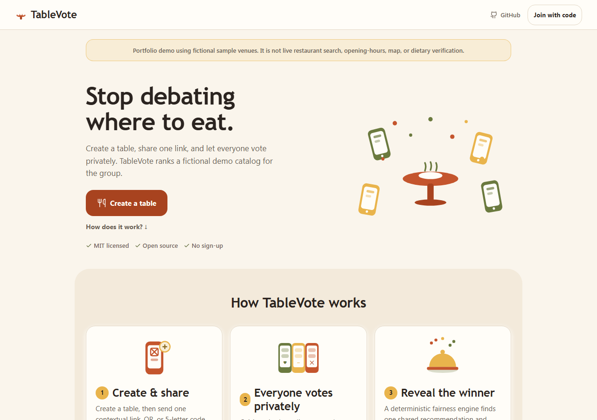
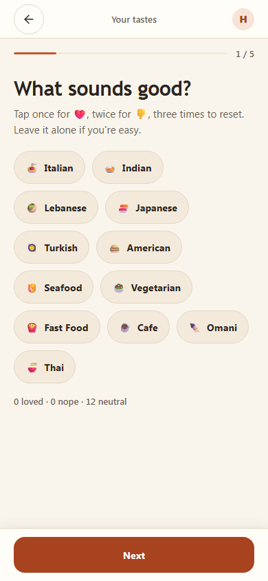
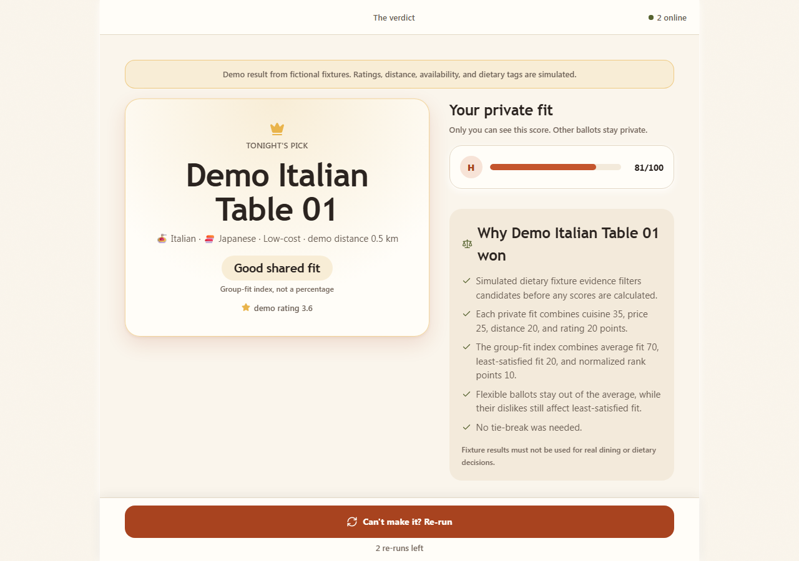
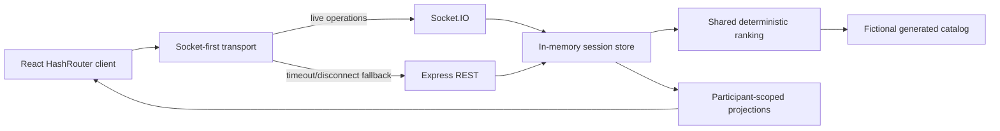

# TableVote

[](https://github.com/HaithamAlMaamari/tablevote/actions/workflows/ci.yml)
[](LICENSE)

**Stop debating where to eat.** TableVote is an accountless group-voting prototype with private ballots, realtime sessions, and a deterministic fairness algorithm.

> **Portfolio demo:** Every bundled restaurant is fictional. Location, radius, rating, distance, availability, and dietary tags are simulated fixtures. TableVote is not live restaurant search, dietary verification, or a production service. Sessions are held in one server process and are lost on restart.

## Demo Walkthrough



1. Run the application and create a table in one browser profile.
2. Open the invite in an Incognito window or a different browser profile.
3. Submit a private ballot from both participants.
4. Reveal the deterministic result from the host window.
5. Try a re-run or mark every dietary item Required to exercise the no-match path.

Use separate browser contexts, not ordinary tabs: participant identity is stored per browser profile.

| Private ballot | Group result |
|---|---|
|  |  |

## Engineering Highlights

- **Deterministic ranking:** one shared TypeScript implementation, fixed precision, canonical tie-breaking, and versioned golden fixtures.
- **Privacy-scoped projections:** participants receive their own ballot and fit, never another participant's raw choices or score.
- **Reliable mutations:** UUID idempotency records make Socket.IO operations safe to retry through REST without repeating side effects.
- **Realtime lifecycle:** reconnect, presence, removal, expiry, ending, and terminal cleanup are covered across API, socket, and browser tests.
- **Fail-closed constraints:** simulated Required dietary evidence filters before ranking; no candidate produces an explicit no-match result.
- **Accessible interaction:** semantic controls, route focus, keyboard dialogs, reduced motion, forced colors, text spacing, and axe checks run in Chromium, Firefox, and WebKit.
- **Deliberate prototype boundary:** in-memory state and fictional data keep the sample focused on product logic rather than pretending to be production infrastructure.

Read the [technical case study](docs/CASE_STUDY.md), [architecture notes](docs/ARCHITECTURE.md), and [threat model](docs/security/THREAT_MODEL.md) for the reasoning behind those choices.

## Quickstart

Prerequisites: Node.js `20.19+` or `22.12+`, npm, and a modern browser.

```bash
npm ci
npm run dev
```

The Vite client runs at `http://localhost:3000`; the Express and Socket.IO server runs at `http://localhost:3001`. Vite proxies API and socket traffic during development.

| Command | Purpose |
|---|---|
| `npm run dev` | Start the local client and server watchers |
| `npm run dev:lan` | Bind Vite to the LAN for trusted local-device testing |
| `npm run generate:catalog` | Recreate the deterministic fictional catalog |
| `npm run check:catalog` | Verify the committed fictional catalog matches its generator |
| `npm test` | Run 61 unit and integration tests |
| `npm run build` | Type-check and build client/server artifacts |
| `npm run test:browser` | Run 33 Chromium, Firefox, and WebKit executions |
| `npm run lint` | Run ESLint |
| `npm run check:docs` | Validate local Markdown links |
| `npm run check:repo` | Reject tracked secrets, local tooling, builds, logs, and reports |
| `npm run audit:prod` | Enforce the documented production dependency policy |
| `npm run smoke:prod` | Smoke-test the built single-port server |

## Current Architecture



The server is a modular monolith. Realtime and REST operations share validation, authorization, quotas, replay records, state transitions, and projection code. See [ARCHITECTURE.md](docs/ARCHITECTURE.md) for details.

## Ranking Summary

1. Required dietary fixture states filter candidates before scoring; they are never relaxed.
2. Each submitted ballot produces cuisine, price, distance, and rating utility.
3. Group score combines average fit, least-satisfied fit, and normalized rank points.
4. Near ties use least misery, Copeland pairwise wins, then canonical fixture ID.
5. Results record algorithm version `tv-rank-1.0.0` and expose only privacy-safe fit bands.

The implementation and tests live in [`shared/scoring.ts`](shared/scoring.ts), [`shared/scoring.test.ts`](shared/scoring.test.ts), and [`shared/fixtures`](shared/fixtures).

## Important Limitations

- The catalog is generated fictional data; see [DATA.md](DATA.md).
- The area and radius inputs demonstrate a planned flow but do not search or filter fixtures.
- Ratings, distances, availability, prices, and dietary states are simulated.
- There are no map directions for fictional records.
- Sessions, capabilities, replay records, and presence live in one Node.js process.
- Restarting the server loses active sessions.
- Development-only local mode stores the whole simulated session in shared browser storage and provides no confidentiality boundary between tabs.
- The security documentation is a maintainer self-assessment, not an independent audit.
- No public deployment is maintained.

## Testing

CI runs on Node.js 20 and 22 and includes secret scanning, repository hygiene, documentation links, lint, 61 Vitest tests, dependency policy, client/server builds, a production smoke test, and 33 Playwright executions across Chromium, Firefox, and WebKit.

Browser coverage includes separate host/guest contexts, privacy payload scanning, responsive widths, text spacing, forced colors, normal/reduced motion, keyboard focus, retry and terminal states, reconnect, removal, end, expiry, strict no-match, and axe WCAG A/AA scans.

## Project Map

```text
shared/                  shared contracts, projections, ranking, and fixtures
server/                  Express, Socket.IO, quotas, lifecycle, and in-memory store
src/pages/               React product flows
src/lib/                 transport, identity storage, and session synchronization
tests/browser/           cross-browser product and accessibility flows
deployment/              local reverse-proxy validation harness
docs/                    architecture, case study, roadmap, and threat model
scripts/                 repository, documentation, audit, and fixture tooling
```

## Contributing and Security

Contributions are welcome. Read [CONTRIBUTING.md](CONTRIBUTING.md), [SECURITY.md](SECURITY.md), and the [Code of Conduct](CODE_OF_CONDUCT.md) before opening a report or pull request.

Never include live invite codes, capabilities, ballots, dietary requirements, exact locations, or other private session data in a public issue.

## License

TableVote and its generated fictional fixtures are available under the [MIT License](LICENSE).
