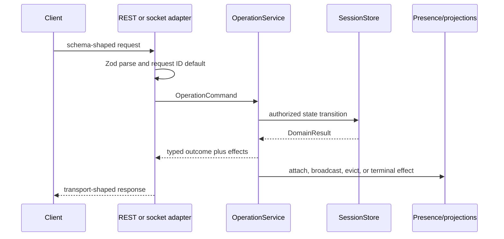

# Architecture

TableVote is a TypeScript modular monolith with a React client, an Express and Socket.IO server, and shared runtime/domain modules. This document describes the checked-in prototype, not a target distributed architecture.

## Module Boundaries

| Boundary                | Responsibility                                                                   |
| ----------------------- | -------------------------------------------------------------------------------- |
| `shared/contracts.ts`   | Zod schemas and inferred request/response types used at runtime                  |
| `shared/failures.ts`    | Typed domain failure catalog and transport-neutral result types                  |
| `shared/scoring.ts`     | Pure deterministic ranking over submitted ballots and catalog records            |
| `shared/projections.ts` | Public invite and participant-private response construction                      |
| `server/operations.ts`  | Authorization-aware operation orchestration, replay handling, and effects        |
| `server/store.ts`       | Authoritative process-local session transitions and lifecycle                    |
| `server/rest.ts`        | REST parsing, route mapping, and HTTP response adaptation                        |
| `server/sockets.ts`     | Socket event parsing, attachment context, quotas, and acknowledgements           |
| `server/presence.ts`    | Socket rooms, online status, private state broadcasts, and terminal events       |
| `src/lib/transport.ts`  | Socket-first calls, REST fallback, response validation, and reconnect attachment |

Shared modules do not depend on browser-only or Node-only APIs. The operation service does not depend on Express or Socket.IO; adapters translate transport inputs into operation commands and operation outcomes into transport responses.

## Request Flow

Create, join, submit, leave, remove, reveal, rerun, and end use this flow. Socket attach also uses the operation service. REST invite and state reads are direct, read-only projections because they do not perform a session mutation or establish socket presence.

The complete mapping is in [OPERATIONS.md](OPERATIONS.md).

## Authorization And Projection

A five-character invite code locates a session but does not authorize private state. Each participant receives an opaque participant capability. The host receives a separate host capability for remove, reveal, rerun, and end operations; the host still needs the host participant capability to read its participant projection.

Authorization is checked against the selected session. Participant projections include roster/submission/presence state, the viewer's own ballot, aggregate-safe result bands, and the viewer's own winner fit. They omit every other raw ballot, exact per-person fit, and internal scoring rows. Public invite projections include only code, area label, expiry, joinability, and an optional host nickname when sharing was enabled.

## State And Lifecycle

`SessionStore` owns maps for active sessions, code lookups, and terminal references. `buildApp` accepts an injected store; the store itself accepts injected state, clock, scheduler, catalog, and token factory dependencies. Production startup uses a default process-local store.

The active deadline is `createdAt + 24 hours`. Each session receives an exact scheduled deletion, and a store lookup at or after the boundary deletes it before returning as a backstop. Expiry listeners run as part of deletion so connected clients receive the terminal event without retaining raw ballots or capabilities.

Ending or expiring removes the active session and its ballots/capabilities, then records a bounded terminal reference containing the code, terminal reason, and removal time. That reference lets stale clients distinguish `ended` from `expired`; it is retained for up to another policy TTL from deletion and is also process-local. All state is lost on restart.

## Mutation Replay

Mutation adapters add a UUID request ID when the caller omits one. The operation service keys successful replay entries by operation kind and request ID, stores a payload fingerprint and response, and retains the entry for 15 minutes within a bounded map.

The same operation and payload receives the stored response. Reusing the key with a different payload returns a conflict. A socket timeout can therefore fall back to REST with the same request ID without intentionally applying the mutation twice. Replay state does not survive restart and is not a distributed idempotency mechanism.

## Ranking

The ranking function first applies hard dietary evidence constraints, then computes fixed-precision utilities and aggregate totals. A deterministic tie ladder resolves near-equal leaders. Internal rows remain on the server and participant projections expose only scoped result fields. See [ADR 0003](adr/0003-deterministic-ranking.md) for rationale and [DATA.md](../DATA.md) for fixture provenance.

## Deployment Boundary

The built server can serve static assets, REST, and Socket.IO from one port. In production mode it requires exact HTTPS origins and a positive trusted-proxy hop count, and it rejects HTTP requests based on the configured proxy trust. Originless non-browser clients are still admitted to the transport boundary and must present capabilities for protected operations.

The repository provides a loopback proxy validation harness, not a hosted topology. A public service would additionally need durable transactional state, multi-instance coordination, secret management, redacted observability, backups, incident ownership, abuse handling, and a deployment-specific security review.

## Decisions

- [ADR 0001: Process-local in-memory state](adr/0001-in-memory-state.md)
- [ADR 0002: Capability-based authorization](adr/0002-capability-authorization.md)
- [ADR 0003: Deterministic consensus ranking](adr/0003-deterministic-ranking.md)
- [ADR 0004: REST and Socket.IO transports](adr/0004-dual-transports.md)
